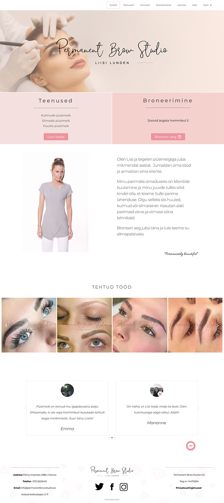
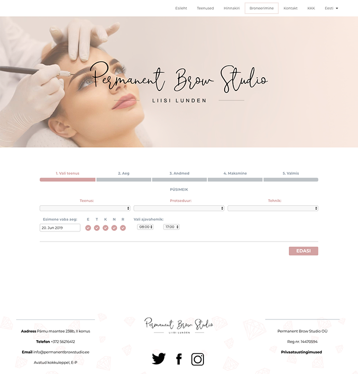
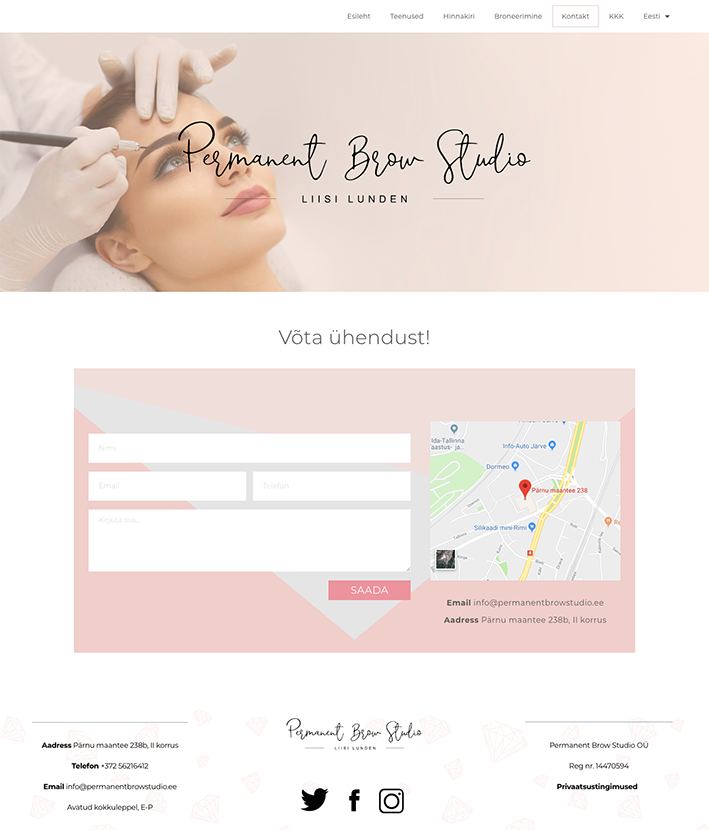

# Permanent Brow Studio
Permanent Brow Studio on veebileht ilusalongile, mis tegeleb kulmude, silmade ja huulte püsimeigiga. Klientidel on võimalik tutvuda salongi pakutavate teenustega, hinnakirjaga, kontaktandmetega, saada ülevaade püsimeigiga seotud küsimutest ning endale aeg broneerida. 
Projekt on loodud 2019 Tallinna Ülikooli Digitehnoloogiate instituudi Informaatika eriala Tarkvaraarenduse praktika tunniga seoses, mille sisuks oli lasta meeskondadel kogeda suurema projekti koostamist, meeskonnatööd ja kliendiga suhtlemist.

## Eesmärk: 
Luua veebileht, mille kaudu on veebilehe tellijal võimalik suurendada kliendibaasi läbi esteetilise ja interaktiivse disaini, mugava funktsionaalsuse ja e-broneerimissüsteemi.

## Arendusvahendid:
* Visual Studio Code 1.35.1
* CSS3
* HTML5
* Javascript JQuery
* Zone 
* Chrome 74
* Facebook
* Yoast 11.4 – SEO
* Google Analytics – SEO
* Elementor Pro v2.5.9 – rakendus, mis aitab ehitada veebilehe disaini
* Bookly 17.3 – broneerimissüsteem
* TranslatePress 1.5.0– Multilingual
* Adobe Illustrator 2018
* Adobe Photoshop 2018

## Projekti meeskond:
* Kristjan Treiman
* Sander Hanni
* Emma Loore Tae
* Marianne Aruste
* Lisa-Marie Väli

### Lehele ligipääsemiseks on vaja läbi internetiühenduse siseneda veebiaadressile www.permanentbrowstudio.ee. 

## Ekraanitõmmised:

